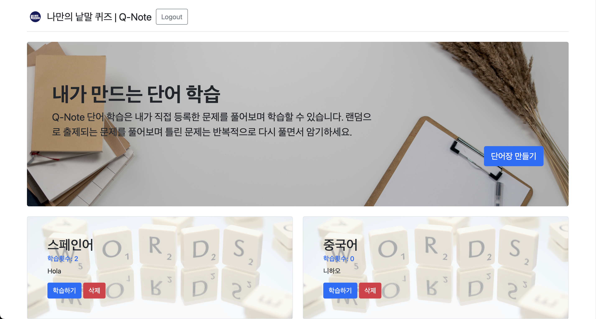
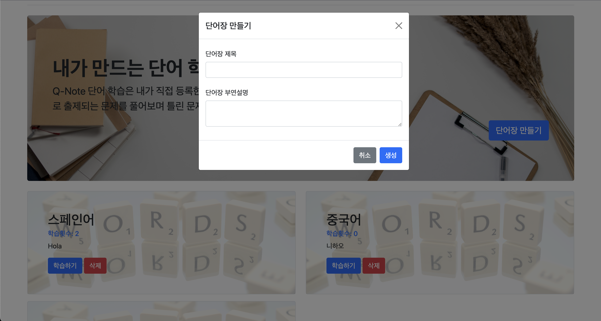
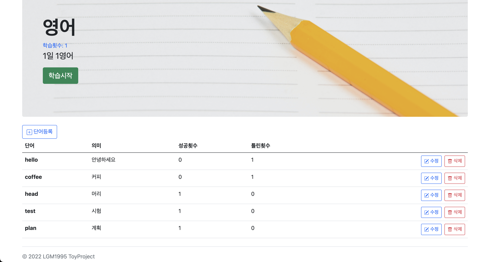
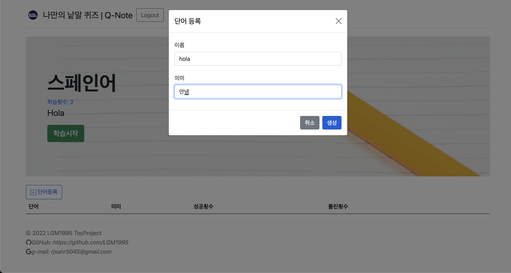
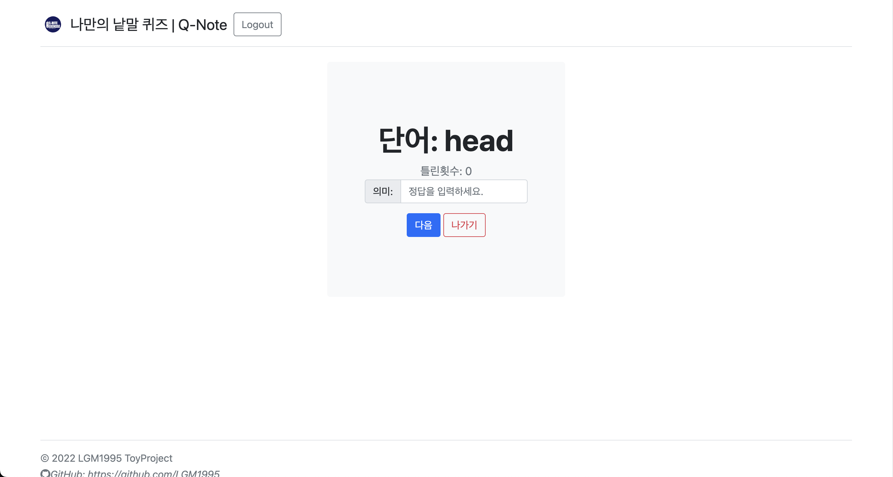
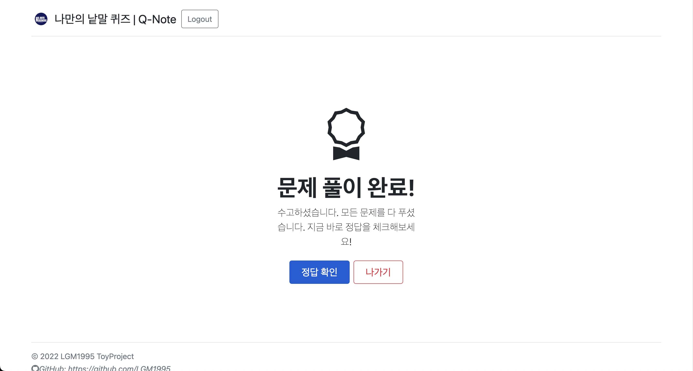
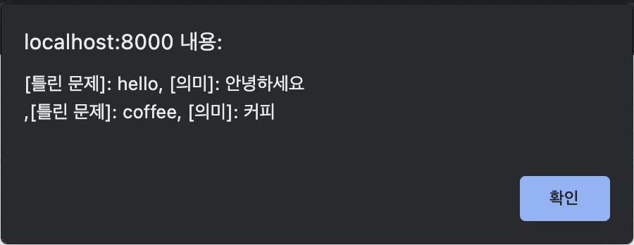
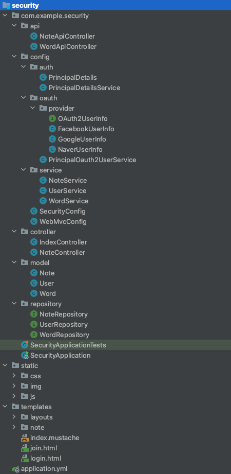
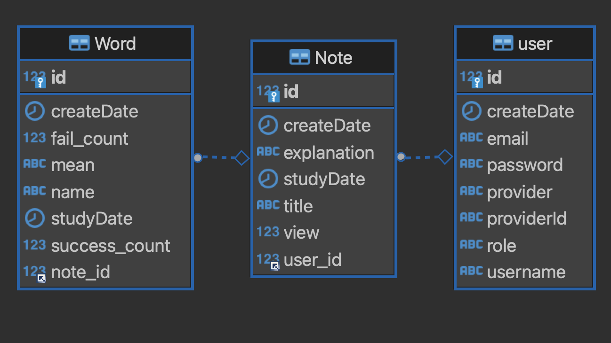

## Q-Note (ToyProject)
>단어 학습을 위한 토이 프로젝트 입니다.

## 목차
* [소개](#소개)
  *  개발 목적
  *  프로젝트 소개
  *  프로젝트 기능

  
* [동작 및 구조](#동작-및-구조) 
  * 사용 기술
    * Back-End
    * Front-End
  * UI (사용자 화면)
    * 로그인 및 회원가입
    * 단어장 및 단어 CRUD
    * 단어 테스트
  * 구조
    * 패키지
    * 데이터베이스

* [결론](#결론)
  * 보완점
  * 후기

## 소개
### 1.개발목적

 본 프로젝트는 웹 프로그래밍 학습과 포트폴리오 제작 목적으로 개발되었으며, 단어장 웹 애플리케이션으로 평소에 공부에 사용할 수 있도록 제작되었습니다.

### 2.프로젝트 소개

 나만의 단어학습 Q-Note는 자유로운 형식으로 단어장을 제작하여 랜덤으로 출제되는 문제를 풀어가는 학습노트입니다.

### 3.프로젝트 기능

 프로젝트 기능

* 로그인 - Spring Security를 활용한 회원가입 및 로그인이 가능하며, OAuth 2.0 구글, 페이스북, 네이버 소셜 로그인이 가능합니다.

* 단어장 - 기본적인 CRUD 기능을 통해 자유로운 단어장과 단어를 등록 및 수정 등을 할 수 있습니다.

* 테스트 - 학습 기능을 통해 랜덤으로 출제되는 단어 리스트들이 학습가능하며 단어장 학습횟수와 단어들의 성공 및 틀린 횟수를 제공하여 집중 학습이 가능합니다.

## 동작 및 구조
### 1.사용기술

### Back-End
* OpenJDK 8
* SpringBoot 2.7.3
* JPA
* Spring Security
* OAuth 2.0
* Lombok
#### Build Tool
* maven 4.0.0
#### DataBase
* mysql
### Front-End
* html/css
* javascript
* mustache
* swiper8
* jquery3.6.1
* bootstrap 5.2.1

##### * 현재 나스 서버와 도커를 활용하여 외부 접근이 가능합니다. 
[Q-Note 바로가기](http://seya.synology.me:28000/login)

### 2. UI (사용자 화면)

로그인 및 회원가입

#### 1. 로그인 화면

#### 2. 회원가입

 

단어장 및 단어 CRUD

#### 1. 메인 페이지

#### 2. 단어장 등록

#### 3. 단어장 Details (학습하기)

#### 4. 단어 등록

 

단어 테스트

#### 1. 테스트 화면

#### 2. 테스트 완료 화면

#### 3. 틀린 문제 확인 (arlet)

### 3. 구조

패키지

 

DB

## 결론

### 1. 보완점
* 모든 알림 (arlet) 커스터마이징
* user 프로필 수정 기능
* 단어 테스트 객관식, 주관식 선택기능
* 단어 테스트 시간제한 기능
* DTO 사용
* 각종 예외 처리
### 2. 후기

Spring Boot의 기본 강의를 학습하며 CRUD 기능이 있으며 실제로 사용할 수 있을 만한 프로젝트를 설계하였습니다. 
비교적 문법이 쉬운 Mustache를 활용하여 feach API를 통한 REST API의 호출로 HTTP 요청 메소드를 통해 JSON을 넘기는 통신 규칙을 실습할 수 있었습니다.
또한 Spring Security와 OAth2을 활용한 로그인 기능을 통해 Session 안에서 Spring Security Session 영역과 그 안에 Authentication을 어떻게 활용하는지 알게 되었습니다. 
다만 기초부터 학습해서 활용하느라 여러 강의를 정주행하였습니다. 비록 시간은 오래 걸렸지만 뜻깊은 학습 시간이 되었습니다. 
번외로 지인의 NAS에 배포할 기회가 생겨 도커에 대해서도 추가로 알게 되었던 의미있는 프로젝트였습니다.

이상으로 저의 Git에 방문해 주셔서 감사합니다.

  